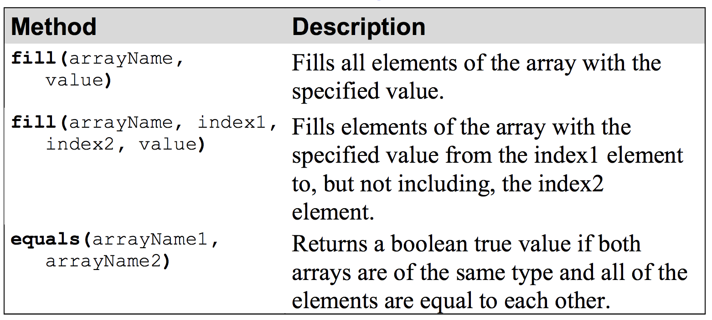
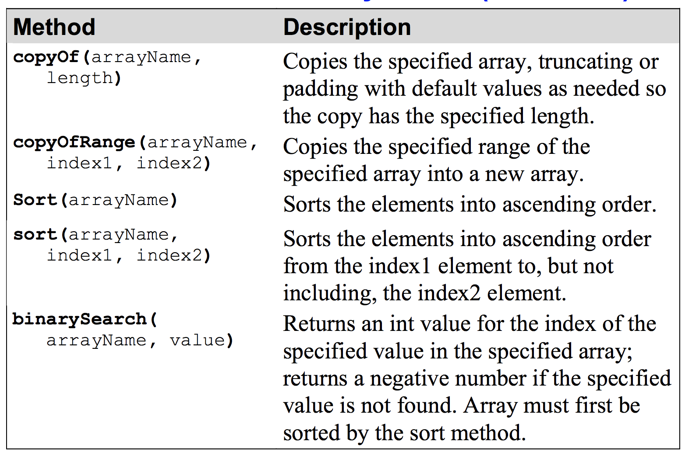

# Arrays and ArrayLists
Array is a data structure that represents a collection of the
same types of data. 

#### How to create an array
- An array can store more than one primitive type or object.
- An element is one of the items in an array.
- To create an array, you must declare a variable of the correct type
and instantiate an array object that the variable refers to.
- To declare an array variable, you code a set of empty brackets after
the type or the variable name.
- To instantiate an array, you use the new keyword and specify the
length, or size, of the array in brackets following the array type.
- You can specify the array length by coding a literal value or by
using a constant or variable of type int.
- When you instantiate an array of primitive types, numeric types are
set to zeros and boolean types to false.
- When you create an array of objects, they are set to nulls.



## ArrayList
#### An introduction to array lists
An array list is a collection that’s similar to an array, but can
change its capacity as elements are added or removed.
- The ArrayList class uses an array to store the elements it contains.
- You can specify the type of elements to be stored in the array list
by naming a type in angle brackets.
- You can specify the size of an array list when you create it, or you
can let the array list default to an initial capacity of 10 elements.
- The capacity of an array list automatically increases whenever
necessary.
```
ArrayList<E>() Creates an empty array list with an
initial capacity of ten objects of the
specified type.
```

```
ArrayList<E>(intCapacity) Creates an empty array list with the
specified capacity.
```

```
ArrayList<E>(Collection) Creates an array list containing the
elements of the specified
collection.
```

```
add(object) Adds the specified object to the end of the list.
```

```
clear() Removes all elements from the list.
```

```
contains(object) Returns true if the specified object is in the
list.
```

```
get(index) Returns the object at the specified index
position.
```

```
indexOf(object) Returns the index position of the specified
object.
```

```
isEmpty() Returns true if the list is empty.
```

```
remove(index) Removes the object at the specified index
position.
```

```
set(index, object) Sets the element at the specified index to the
specified object.
```

```
size() Returns the number of elements in the list.
```

```
toArray() Returns an array containing the elements of
the list.
```

e.g.
```
// create an array list of type String
ArrayList<String> codes = new ArrayList<String>();
```
