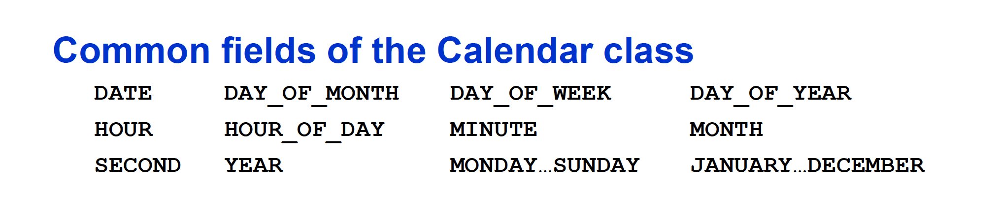

### Common constructors of the GregorianCalendar
```
GregorianCalendar() 
Creates a GregorianCalendar object set to the current date and time.
```
```
GregorianCalendar( year, month, day) 
Creates a GregorianCalendar object set to the specified date.
```
```
GregorianCalendar( year, month, day, hour, minute) 
Creates a GregorianCalendar object set to the specified date and time.
```
```
GregorianCalendar( year, month, day, hour, minute, second) 
Creates a GregorianCalendar object set to the specified date and time.
```

* Format must be YYYY, M[0-11], D[1-31], H[0-23], M[0-59], S[0-59]

